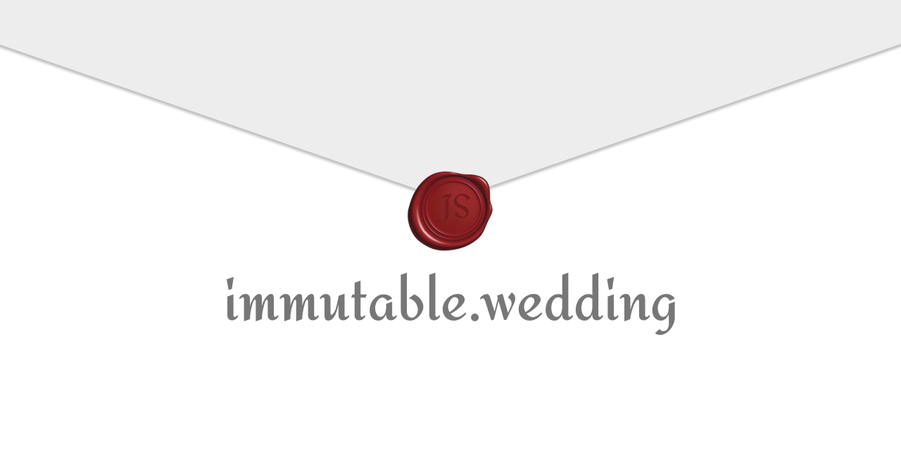

  

## 🍀 In this template

- support anonymous comment with [supabase](https://supabase.io/)
- easy to edit contents
- animation with [framer-motion](https://www.framer.com/motion/)

## 🤖 Demo

👉 [Default Template](https://immutable.wedding/)

[soso](https://github.com/SoYoung210) and [Jbee](https://github.com/jaeYeopHan)'s [wedding log](https://immutable-wedding-n5544hqad-soso02.vercel.app/)

## 🚀 Usage

### 1. Set runtime environment

[Create a supabase project](https://supabase.io/docs/guides/with-nextjs) and add `NEXT_PUBLIC_SUPABASE_URL` / `NEXT_PUBLIC_SUPABASE_ANON_KEY` environment variables to the next.js project.

### 2. Edit Contents

- Update `public/assets/data/*.json` with your information.
- Add your contents image to `public/img`

### 3. Publish with Vercel

Deploy your wedding log using [Vercel](https://vercel.com/):

## ❣️ Authors

<!-- prettier-ignore-start -->
<!-- markdownlint-disable -->
<table>
  <tr>
   <td align="center"><a href="https://github.com/JaeYeopHan"> <b>Jbee</b></a> 📆 🎨 💻
    <td align="center"><a href="https://so-so.dev"> <b>soso</b></a> 💻 🚇 📖
  </tr>
</table>
